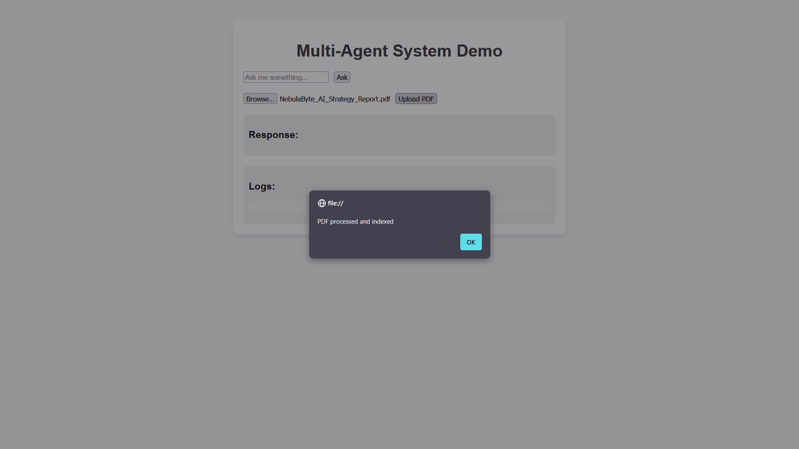

# Multi-Agent Retrieval-Augmented Generation (RAG) System

This project is a multi-agent orchestration framework built on **FastAPI** and the **Gemini API**. It features an intelligent **Controller Agent** that dynamically routes user queries to specialized agents, including a citation-aware PDF RAG system, a Web Search agent, and an Arxiv Search agent.

## Features

# Architecture Overview

This project implements a **Multi-Agent Retrieval-Augmented Generation (RAG)** system designed for dynamic and source-agnostic querying. The system intelligently routes user requests to specialized agents to ensure contextually relevant and accurate responses.

***


## Key Components

The application follows a clear architectural flow, with a central **Controller Agent** directing traffic to specialized RAG and search agents.

| Component | Description | Technologies / Function |
| :--- | :--- | :--- |
| **Frontend** | A single-page application providing the user interface. | **Search Box**, **PDF Upload Widget**, and a unified **Response + Logs UI**. |
| **FASTAPI Backend** | Serves as the central API gateway for all user and system interactions. | Endpoints: `/ask`, `/upload_pdf`, and `/logs`. |
| **Controller Agent** | The core routing and reasoning engine, directing queries to the appropriate specialized agents. | Uses **Gemini LLM** for Routing decisions, reasoning logging, and final summarization of multiple results. |
| **PDF RAG** | Handles queries against the user's uploaded, private knowledge base. | Uses **FAISS** for fast vector search and RAG for summarizing retrieved document chunks. |
| **Web Search** | Provides access to current, external information. | Uses **DuckDuckGo** for searching, with **Gemini** processing and summarizing the search results. |
| **Arxiv Agent** | Integrates with the Arxiv library to find and summarize technical papers. | Specialized retrieval and summarization for academic data. |
| **Logging and Trace** | A centralized storage component that persists the full history of every query. | Stores a complete history of **Query -> Decisions -> Agents -> Output** in `logs/trace.json`. |

## Setup and Run

### 1. Prerequisites

- Python 3.9+
- A **Google Gemini API Key**.

### Environment Setup

Clone the repository and install the dependencies:

```bash
pip install -r requirements.txt
```

##  API Key Configuration

1. Create a file named .env in the root directory.
2. Add your API key:
```bash
# .env
GOOGLE_API_KEY="YOUR_API_KEY_HERE"
```
## Generate Sample Data

Run the utility script to create internal PDF documents for the RAG agent:
```bash
python generate_pdfs.py
```
This populates the sample_pdfs/ folder.

## Start the Server

Start the FastAPI application:
```bash
# .env
# The server runs on [http://127.0.0.1:8000](http://127.0.0.1:8000)
uvicorn main:app --reload
```

###  How to Use

1. Open the Frontend: Navigate to frontend/index.html in your web browser.

2. Ingest PDFs: Before querying, use the "Upload PDF" button to ingest the sample documents (or your own pdf that includes text) from the sample_pdfs/ folder. This builds the internal FAISS vector store.

3. Ask a Query: Enter a question in the "Ask me something..." box. The system will automatically route the query to the correct agent(s).

4. Check Logs: The "Logs" section provides a detailed trace of the agent decision process.

## ⚠️ Operational Note: Post-Upload Routing Behavior

Users may observe that the queries following a successful PDF upload is often misrouted to the **PDF_RAG** agent, even if the question is general (e.g., "What is the capital of France?"). This agent will correctly respond with "not in pdf."

**Solution:**

To restore the dynamic LLM routing (i.e., routing to `Web_Search` or `Arxiv_Search`), simply **refresh the browser page** (`frontend/index.html`) and re-submit the query. The system will then correctly use the Controller Agent's logic for all subsequent queries.

## Some Demo/Test Images:

PDF-Agent in Action (Successful PDF upload, query asked related to the PDF along with response & logs):




Web-Agent in Action (Query about Prime Minister of Nepal along with response and logs):


Arxiv-Agent in Action (Query about summarizing recent research done in astrophysics along with response and logs):


### NOTE: This project was specifically built for Solar Industries India Ltd. Internship assessment.